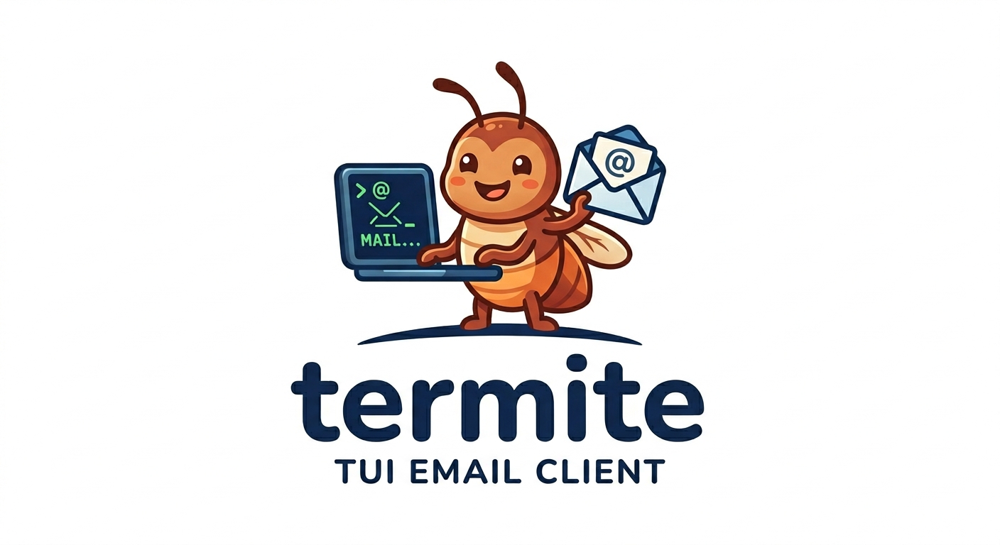

<p align="center">
  
</p>

<h1 align="center">termite</h1>
<p align="center"><strong>A TUI email client that rivals the look, feel, and convenience of Superhuman.</strong></p>

<p align="center">
  <a href="#features">Features</a> •
  <a href="#installation">Installation</a> •
  <a href="#setup">Setup</a> •
  <a href="#usage">Usage</a> •
  <a href="#bring-your-own-auth">BYO Auth</a> •
  <a href="#roadmap">Roadmap</a>
</p>

---

## Features

- **Keyboard-first navigation** — Every action is a keystroke away. No mouse required.
- **Split inboxes** — Create custom inboxes, route senders (by email or entire domain), and declutter your Primary inbox.
- **Multiple accounts** — Add as many Gmail accounts as you need. Each account has isolated inboxes, threads, and achievements.
- **Background sync daemon** — Emails sync automatically while you work. New mail appears instantly.
- **Inline reply/forward** — Compose replies without leaving your inbox view.
- **Email signatures** — Configurable per-account signatures, plus a "Sent with termite" link.
- **Productivity metrics** — Track your inbox-zero streaks and clearing milestones.
- **Desktop notifications** — Get notified when new mail arrives (macOS, Linux, Windows).
- **Dark theme** — Beautiful, minimal dark UI out of the box.

## Installation

### Homebrew (macOS / Linux)

```bash
brew tap marcusjhanford/termite
brew install termite
```

### Binary Download

Download the latest release for your platform from the [Releases](https://github.com/marcusjhanford/termite/releases) page.

### Build from Source

```bash
git clone https://github.com/marcusjhanford/termite.git
cd termite
go build .
```

**Note for Gmail users:** The official release binaries embed a Google OAuth client secret at link time. If you build from source, you will need to provide your own OAuth credentials (see [Bring Your Own Auth](#bring-your-own-auth)).

## Setup

On first launch, Termite opens a setup wizard to connect your Gmail account.

```bash
termite
```

### Gmail Setup

1. Select **Gmail** as your provider.
2. Enter your email address.
3. Your browser will open for Google OAuth sign-in.
4. Approve access and return to Termite.
5. Initial sync starts automatically.

### Adding More Accounts

You can add additional Gmail accounts anytime:

```
:account add
```

Or switch between accounts:

```
:account list
:account switch <email>
```

## Usage

### Global Keys

| Key | Action |
|-----|--------|
| `j` / `k` | Navigate down / up |
| `Tab` | Switch focus pane |
| `/` | Search |
| `:` | Command bar |
| `?` | Help |
| `q` | Quit |

### Thread Actions

| Key | Action |
|-----|--------|
| `c` | Compose new message |
| `r` | Reply |
| `R` | Reply All |
| `f` | Forward |
| `e` | Archive |
| `d` | Delete |
| `m` | Mark as read |
| `v` | Move to inbox |
| `!` | Mark domain as spam |

### Commands

| Command | Description |
|---------|-------------|
| `:account list` | List connected accounts |
| `:account switch <id>` | Switch active account |
| `:inbox create <name>` | Create a split inbox |
| `:inbox delete <name>` | Delete a split inbox |
| `:daemon start` | Start background sync |
| `:daemon stop` | Stop background sync |

### Split Inboxes

Create a new inbox:

```
:inbox create Marketing
```

Move a thread to an inbox with `v`, then choose whether to route future emails from that sender there too.

## Bring Your Own Auth

Termite uses **OAuth 2.0** for Gmail authentication. The official release binaries include a pre-configured Google OAuth client secret, but if you build from source or want to use your own credentials:

### 1. Create a Google Cloud OAuth Client

1. Go to [Google Cloud Console](https://console.cloud.google.com/)
2. Create a project (or use an existing one)
3. Navigate to **APIs & Services → OAuth consent screen**
4. Choose **External** (or Internal if you have a Workspace)
5. Fill in the required app information
6. Navigate to **Credentials → Create Credentials → OAuth client ID**
7. Choose **Desktop app** as the application type
8. Copy the **Client ID** and **Client secret**

### 2. Set Environment Variables

```bash
export TERMITE_GMAIL_CLIENT_ID="your-client-id.apps.googleusercontent.com"
export TERMITE_GMAIL_CLIENT_SECRET="your-client-secret"
```

Then run Termite:

```bash
termite
```

The OAuth flow will use your credentials instead of the built-in ones.

### Why BYO Auth?

- You control your own OAuth app and scopes
- No dependency on the project's shared client secret
- Required if you build from source (the release secret is only embedded in CI builds)

## Roadmap

- [x] Gmail OAuth support
- [x] Split inboxes with sender routing
- [x] Multi-account workspaces
- [x] Background sync daemon
- [x] Inline compose with signatures
- [ ] Outlook support
- [ ] Fastmail support
- [ ] Generic IMAP support
- [ ] PGP encryption
- [ ] Snooze
- [ ] Templates

## Contributing

Contributions are welcome! Please open an issue or PR on [GitHub](https://github.com/marcusjhanford/termite).

## License

MIT © Marcus J. Hanford
